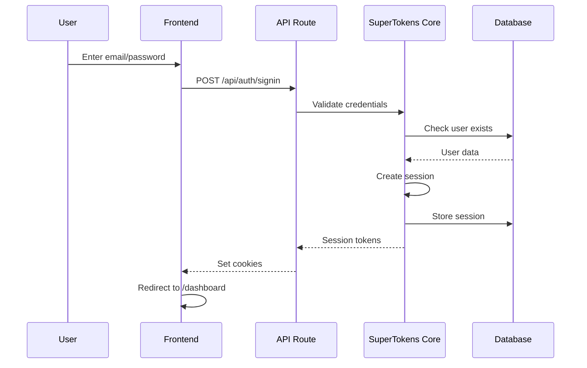
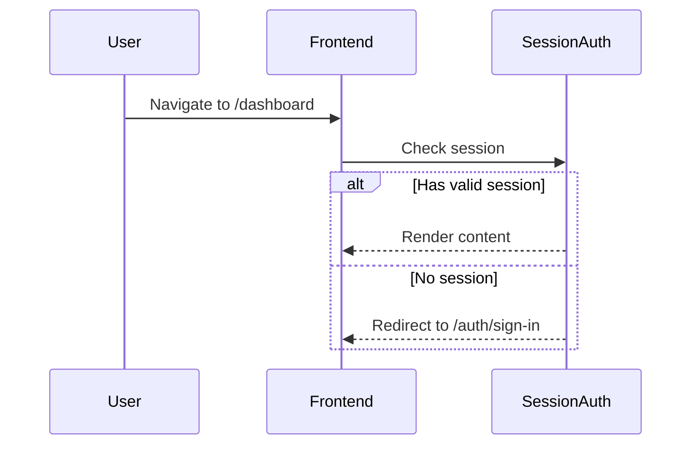

# Система авторизации SunApp

> **Технология:** SuperTokens (Self-Hosted)  
> **Дата обновления:** 2026-02-08

---

## Обзор архитектуры

```
┌─────────────────────────────────────────────────────────────────┐
│                         Frontend (Next.js)                       │
│  ┌─────────────┐  ┌─────────────┐  ┌──────────────────────────┐ │
│  │ AuthForm    │  │ UserNav     │  │ SuperTokensProvider      │ │
│  │ (sign-in/up)│  │ (dropdown)  │  │ └─ SessionAuth wrapper   │ │
│  └──────┬──────┘  └──────┬──────┘  └────────────┬─────────────┘ │
│         │                │                      │                │
│         └────────────────┴──────────────────────┘                │
│                          │                                       │
│                   supertokens-web-js                             │
│                   supertokens-auth-react                         │
└─────────────────────────────┬───────────────────────────────────┘
                              │
                    ┌─────────▼─────────┐
                    │  /api/auth/*      │
                    │  (Next.js API)    │
                    │  supertokens-node │
                    └─────────┬─────────┘
                              │
                    ┌─────────▼─────────┐
                    │  SuperTokens Core │
                    │  (Docker :3567)   │
                    └─────────┬─────────┘
                              │
                    ┌─────────▼─────────┐
                    │   PostgreSQL      │
                    │   (Docker :5432)  │
                    └───────────────────┘
```

---

## Текущие возможности

### ✅ Реализовано

| Функция | Статус | Описание |
|---------|--------|----------|
| **Email/Password Sign Up** | ✅ | Регистрация с email и паролем |
| **Email/Password Sign In** | ✅ | Вход с email и паролем |
| **Sign Out** | ✅ | Выход из системы |
| **Session Management** | ✅ | Cookie-based сессии |
| **Protected Routes** | ✅ | Защита через `SessionAuth` |
| **User Info Display** | ✅ | Email в header и sidebar |
| **Custom UI** | ✅ | Кастомные формы (не SuperTokens UI) |

### ⏳ Не реализовано (можно добавить)

| Функция | Статус | Сложность |
|---------|--------|-----------|
| Password Reset | ⏳ | Низкая |
| Email Verification | ⏳ | Низкая |
| Social Auth (Google, GitHub) | ⏳ | Средняя |
| Multi-Factor Auth (MFA) | ⏳ | Средняя |
| Multi-tenancy (Organizations) | ⏳ | Высокая |
| Role-Based Access Control | ⏳ | Средняя |

---

## Структура файлов

```
src/
├── app/
│   ├── auth/
│   │   ├── sign-in/page.tsx        # Страница входа
│   │   └── sign-up/page.tsx        # Страница регистрации
│   ├── api/auth/[[...path]]/
│   │   └── route.ts                # API handler для SuperTokens
│   └── dashboard/                  # Защищённые страницы
│
├── components/
│   ├── auth/
│   │   ├── supertokens-provider.tsx  # Провайдер + SessionAuth
│   │   └── session-auth.tsx          # Wrapper для защиты роутов
│   └── layout/
│       ├── user-nav.tsx              # Dropdown пользователя
│       └── app-sidebar.tsx           # Sidebar с инфо юзера
│
├── features/auth/components/
│   ├── auth-form.tsx               # Форма sign-in/sign-up
│   ├── github-auth-button.tsx      # (не используется)
│   └── user-auth-form.tsx          # (устаревшее)
│
└── lib/supertokens/
    ├── config.ts                   # Backend конфигурация
    └── frontend-config.ts          # Frontend конфигурация
```

---

## Как работает авторизация

### 1. Регистрация (Sign Up)

```
┌──────────────┐   POST /api/auth/signup   ┌─────────────┐
│  AuthForm    │ ────────────────────────► │ SuperTokens │
│  (frontend)  │                           │   Core      │
└──────────────┘                           └──────┬──────┘
                                                  │
                                           Creates user
                                           Creates session
                                                  │
                                                  ▼
                                           ┌──────────────┐
                                           │  PostgreSQL  │
                                           │  (users,     │
                                           │   sessions)  │
                                           └──────────────┘
```

**Файл:** `src/features/auth/components/auth-form.tsx`

```typescript
const response = await signUp({
    formFields: [
        { id: 'email', value: email },
        { id: 'password', value: password }
    ]
});

if (response.status === 'OK') {
    router.push('/dashboard/overview');
}
```

### 2. Создание сессии

При успешной регистрации/входе:
1. Создаётся сессия в SuperTokens Core
2. Email добавляется в `accessTokenPayload` (custom logic)
3. Устанавливаются cookies: `sAccessToken`, `sRefreshToken`

**Файл:** `src/lib/supertokens/config.ts`

```typescript
createNewSession: async function (input) {
    const user = await SuperTokens.getUser(input.userId);
    const email = user?.loginMethods.find(
        (lm) => lm.recipeId === 'emailpassword'
    )?.email;

    input.accessTokenPayload = {
        ...input.accessTokenPayload,
        ...(email ? { email } : {})
    };

    return originalImplementation.createNewSession(input);
}
```

### 3. Проверка сессии на Frontend

**Файл:** `src/components/auth/supertokens-provider.tsx`

```typescript
<SessionAuth requireAuth={false}>
    {children}
</SessionAuth>
```

Это предоставляет контекст для `useSessionContext()`.

### 4. Получение данных пользователя

**Файл:** `src/components/layout/user-nav.tsx`

```typescript
const session = useSessionContext();

const userEmail = session.accessTokenPayload?.email;
const userName = userEmail?.split('@')[0];
```

### 5. Защита роутов

**Файл:** `src/components/auth/session-auth.tsx`

```typescript
<SuperTokensSessionAuth
    requireAuth={true}
    onSessionExpired={() => router.push('/auth/sign-in')}
>
    {children}
</SuperTokensSessionAuth>
```

### 6. Sign Out

**Файл:** `src/components/layout/user-nav.tsx`

```typescript
const handleSignOut = async () => {
    await signOut();
    router.push('/auth/sign-in');
};
```

---

## Session Payload

Данные доступные в `session.accessTokenPayload`:

```typescript
{
    email: "user@example.com",  // Добавлено в createNewSession override
    // Стандартные claims:
    iat: 1234567890,            // Issued at
    exp: 1234567890,            // Expiration
    sub: "user-uuid",           // User ID
    // Future (можно добавить):
    // tenantId: "org-123",
    // roles: ["admin", "user"]
}
```

---

## API Endpoints

Все endpoints обрабатываются через `/api/auth/*`:

| Endpoint | Method | Описание |
|----------|--------|----------|
| `/api/auth/signup` | POST | Регистрация |
| `/api/auth/signin` | POST | Вход |
| `/api/auth/signout` | POST | Выход |
| `/api/auth/session/refresh` | POST | Обновление токена |

---

## Docker сервисы

```yaml
# docker-compose.yml
services:
  postgres:      # БД для приложения + SuperTokens
    port: 5432
    
  supertokens:   # Authentication service
    port: 3567
    image: supertokens-postgresql:latest
```

---

## Environment Variables

```env
# .env.local
NEXT_PUBLIC_APP_URL=http://localhost:3000
NEXT_PUBLIC_API_DOMAIN=http://localhost:3000
NEXT_PUBLIC_API_BASE_PATH=/api/auth

SUPERTOKENS_CONNECTION_URI=http://localhost:3567
SUPERTOKENS_API_KEY=           # Установить в production!
```

---

## Диаграмма потоков

### Sign In Flow



### Protected Route Access


